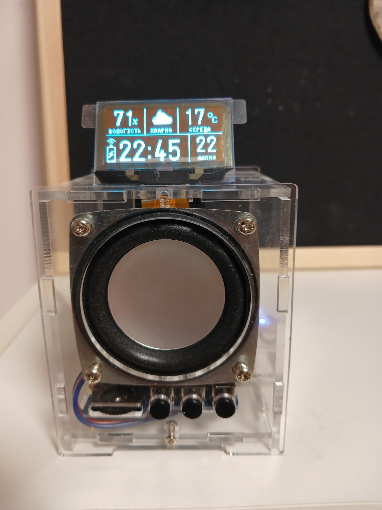
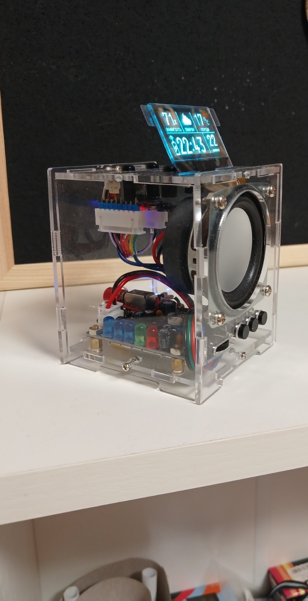
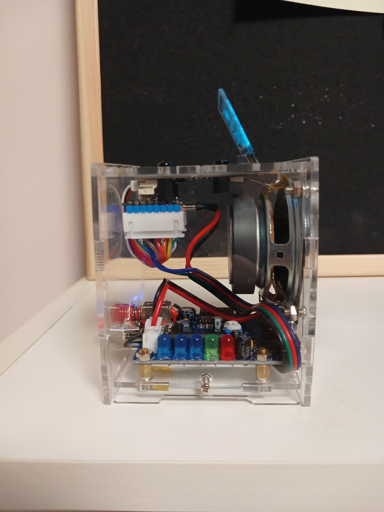
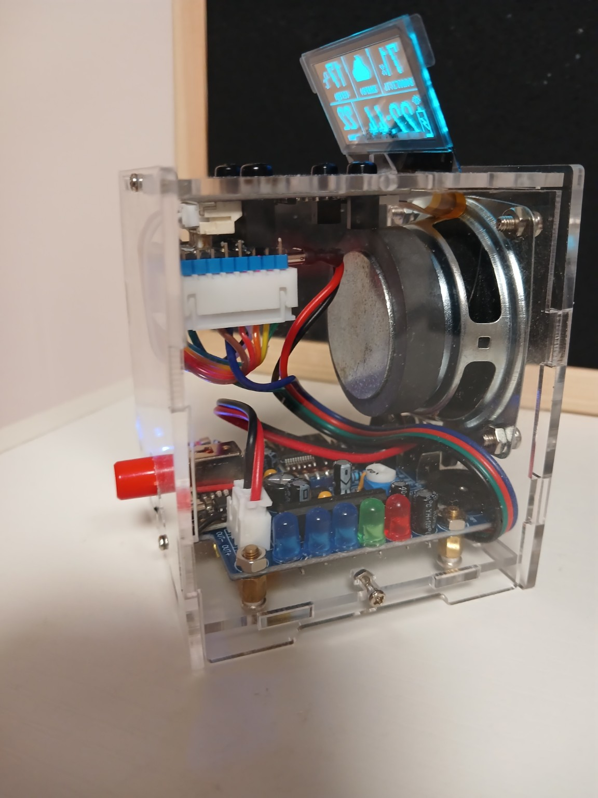
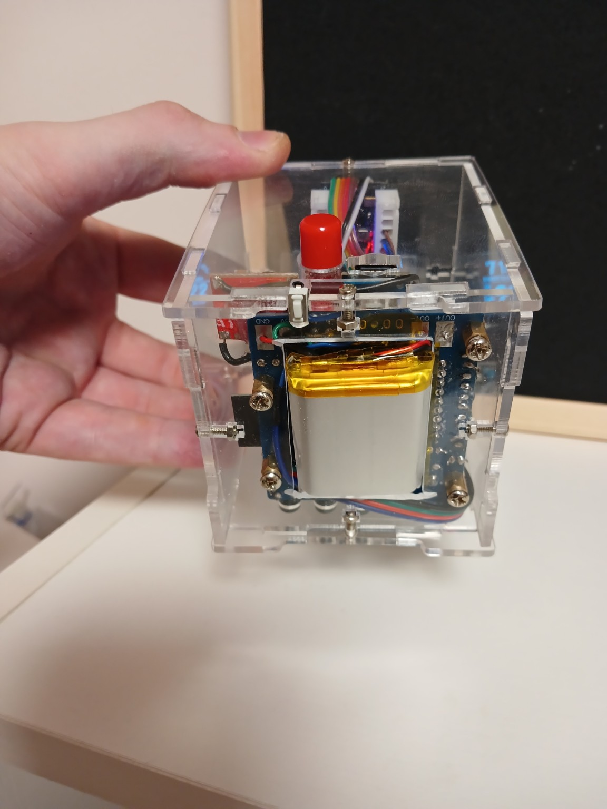

# Mini OLED v1.0.0 — Transparent HUD

A compact transparent Bluetooth speaker conversion built around an HU-009 enclosure, an ESP32-C3 Super Mini and a 1.51-inch transparent SSD1309 OLED.



The stock HU-009 audio path remains independent. The ESP32-C3 drives the transparent HUD, connects to Wi-Fi, synchronizes time, fetches weather, stores configuration in NVS and measures the Li-ion battery through GPIO1.

## Features

- permanent 128×64 HUD with time, date, temperature, humidity and weather state;
- Ukrainian interface;
- local Wi-Fi configuration portal;
- NTP synchronization and OpenWeather current conditions;
- Wi-Fi status icon;
- vertical battery icon with an XOR lightning glyph;
- GPIO1 battery ADC through a 100 kΩ / 100 kΩ divider;
- GPIO9 BOOT/configuration button support;
- sleep-kitty bitmap retained as an Easter egg;
- no hard-coded home Wi-Fi credentials or weather API key.

## Hardware

- HU-009 transparent Bluetooth speaker/enclosure;
- ESP32-C3 Super Mini;
- Waveshare 1.51-inch transparent OLED, SSD1309, 128×64, 4-wire SPI;
- single-cell Li-ion/Li-Po battery and boost/power path;
- two 100 kΩ resistors for battery sensing;
- optional normally-open configuration button.

## Wiring

### Transparent OLED

| OLED | ESP32-C3 |
|---|---:|
| `VCC` | `3V3` |
| `GND` | `GND` |
| `DIN` | `GPIO10` |
| `CLK` | `GPIO8` |
| `CS` | `GPIO7` |
| `DC` | `GPIO6` |
| `RST` | `GPIO5` |

Power the OLED from **3.3 V**.

### Battery ADC

```text
BAT+ ---- 100 kΩ ----+---- GPIO1 / ADC1_CH1
                     |
                  100 kΩ
                     |
                    GND

Battery/HU-009 GND -------- ESP32-C3 GND
```

### Configuration button

```text
GPIO9 ---- normally-open button ---- GND
```

GPIO9 is an ESP32-C3 boot-strap pin. Press it only after the main HUD has appeared. Holding it during power-on or reset can enter the flashing bootloader.

## Arduino IDE

Recommended settings:

```text
Board: ESP32C3 Dev Module
USB CDC On Boot: Enabled
Flash Size: match the actual board
```

Install:

- **U8g2** by olikraus;
- **ArduinoJson** by Benoit Blanchon;
- a current Arduino core for ESP32.

Open `MINI_OLED_C3_SuperMini_UI/MINI_OLED_C3_SuperMini_UI.ino`.

## First setup

On first boot the device starts a local access point:

```text
SSID: MINI-OLED-SETUP
Password: oledsetup
URL: http://192.168.4.1
```

Enter the Wi-Fi credentials, OpenWeather API key and location such as `Kyiv,UA`. To reopen the portal, hold GPIO9/BOOT for about five seconds after the main HUD is running.

> Upgrading from an internal pre-release build changes the saved portal namespace; enter the settings once again.

## Battery calibration

Starting values:

```cpp
BATTERY_VOLTAGE_SCALE  = 1.000f;
BATTERY_VOLTAGE_OFFSET = 0.000f;
BATTERY_EMPTY_VOLTAGE  = 3.30f;
BATTERY_FULL_VOLTAGE   = 4.20f;
```

Compare the Serial voltage with a multimeter. Adjust scale and offset first, then tune the empty/full endpoints for the actual cell and power path.

## Gallery





